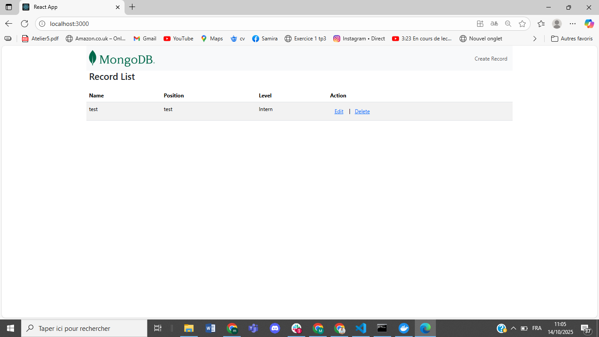

# MERN APP

## Vue d'Ensemble
Ce projet est une application full-stack qui consiste en un client React et un serveur Node.js utilisant MongoDB comme base de données. Docker est utilisé pour la conteneurisation, et Docker Compose est utilisé pour orchestrer les services.

## Capture d'écran de l'exécution


## Table des Matières
- [MERN APP](#mern-app)
  - [Vue d'Ensemble](#vue-densemble)
  - [Capture d'écran de l'exécution](#capture-décran-de-lexécution)
  - [Table des Matières](#table-des-matières)
  - [Technologies Utilisées](#technologies-utilisées)
  - [Variables d'Environnement](#variables-denvironnement)
  - [Configuration de Docker](#configuration-de-docker)
  - [Images Docker](#images-docker)
  - [Docker Compose](#docker-compose)
  - [CI avec Jenkins](#ci-avec-jenkins)
    - [Capture d'écran - Pipeline Jenkins](#capture-décran---pipeline-jenkins)
  - [Prérequis pour la CI (Jenkins)](#prérequis-pour-la-ci-jenkins)
  - [Jenkinsfile (pipeline) — résumé et conseils](#jenkinsfile-pipeline--résumé-et-conseils)
  - [Intégration de Trivy (analyse de vulnérabilités)](#intégration-de-trivy-analyse-de-vulnérabilités)
  - [GitLab CI (exemple `.gitlab-ci.yml`)](#gitlab-ci-exemple-gitlab-ciyml)
  - [Livrables demandés](#livrables-demandés)
  - [Comment Exécuter le Projet](#comment-exécuter-le-projet)

## Technologies Utilisées
- **Frontend** : React
- **Backend** : Node.js, Express
- **Base de Données** : MongoDB
- **Conteneurisation** : Docker, Docker Compose

## Variables d'Environnement
Les variables d'environnement suivantes sont utilisées dans l'application :

- **REACT_APP_API_URL** : Cette variable contient l'URL de base pour le serveur API. Elle est utilisée dans le client React pour faire des requêtes au serveur.
- **MONGO_URI** : L'URI de connexion à MongoDB utilisée par le serveur pour se connecter à l'instance MongoDB.

## Configuration de Docker
Ce projet comprend des Dockerfiles pour le client et le serveur, qui facilitent la construction et l'exécution des services dans des conteneurs isolés. Les configurations incluent :

- **Client** : Un environnement Node.js pour construire l'application React. Les dépendances sont installées et l'application est construite pour une utilisation en production. Un serveur HTTP simple peut être utilisé pour servir l'application construite.
  
- **Serveur** : Un environnement Node.js qui installe les dépendances nécessaires et configure l'application pour écouter sur un port spécifique.

## Images Docker
Les images Docker créées pour ce projet sont les suivantes :

- **Image du Client** : `node:lts-alpine`
- **Image du Serveur** : `node:lts-alpine`
- **Image de la Base de Données** : `mongo:latest`

Ces images sont spécifiées dans les Dockerfiles respectifs et sont utilisées lors de la construction et du déploiement des services.

## Docker Compose
Docker Compose est utilisé pour gérer les différents services de l'application, y compris le client, le serveur et MongoDB. Les services sont interconnectés, ce qui permet une communication fluide entre le client et le serveur. Le fichier de configuration spécifie les images, les ports exposés, ainsi que les variables d'environnement nécessaires pour chaque service.

## CI avec Jenkins
Ce projet inclut un fichier `Jenkinsfile` (pipeline déclarative) pour automatiser la construction et la publication des images Docker du client et du serveur.

Principales caractéristiques de la pipeline Jenkins fournie :
- **Checkout** : récupération du code depuis le dépôt (`main`).
- **Docker Login** : connexion à Docker Hub via des identifiants Jenkins (`credentialsId`).
- **Build & Push** : construction des images pour `server` et `client` si les `Dockerfile` existent, puis push vers Docker Hub avec le tag `${BUILD_NUMBER}` et `latest`.
- **Scans de sécurité** : exécution de `trivy` pour scanner les images (sévérités CRITICAL et HIGH) et archivage des rapports.
- **Cleanup** : nettoyage (`docker system prune -af`) en post étape.

Variables et credentials importants (définis dans le `Jenkinsfile` ou à configurer dans Jenkins) :
- `REPO_URL` et `BRANCH` : dépôt et branche à builder.
- `DOCKERHUB_CREDENTIALS` : ID des credentials Jenkins (username/password) pour Docker Hub.
- `IMAGE_SERVER` et `IMAGE_CLIENT` : noms d'images Docker Hub (ex. `username/mern-server`).
- `DOCKER_BUILDKIT` : activé pour builds plus rapides.

Comment utiliser la pipeline Jenkins :
1. Ajouter un `credential` de type username/password dans Jenkins et noter son ID (ex. `dockerhub`).
2. Adapter les variables `IMAGE_SERVER` et `IMAGE_CLIENT` dans le `Jenkinsfile` ou dans les paramètres du job.
3. Créer un job pipeline pointant vers ce dépôt (ou importer via multibranch pipeline).
4. Lancer le job : il construira les images, les poussera sur Docker Hub et archivera les rapports Trivy.

Extrait (résumé) du `Jenkinsfile` :

```groovy
stage('Build & Push Server Image') {
  when { expression { return fileExists('server/Dockerfile') } }
  steps {
    sh '''
      docker build -t ${IMAGE_SERVER}:${BUILD_NUMBER} server
      docker push ${IMAGE_SERVER}:${BUILD_NUMBER}
      docker tag ${IMAGE_SERVER}:${BUILD_NUMBER} ${IMAGE_SERVER}:latest
      docker push ${IMAGE_SERVER}:latest
    '''
  }
}
```

### Capture d'écran - Pipeline Jenkins
Voici une capture d'écran de l'exécution de la pipeline Jenkins (fichier fourni : `jenkins.png`) :


Sécurité et bonnes pratiques :
- Ne mettez jamais vos identifiants Docker Hub dans le dépôt. Utilisez les `credentials` Jenkins.
- Vérifiez et examinez les rapports Trivy pour corriger les vulnérabilités critiques.
- Pensez à limiter les droits de l'utilisateur Docker Hub utilisé pour le push.


## Prérequis pour la CI (Jenkins)
- Docker installé sur la machine Jenkins (ou utilisation de Docker-in-Docker).
- Un compte Docker Hub et des identifiants Jenkins (`username/password`) stockés comme `credentials` (ex. `dockerhub`).
- Clé SSH Jenkins (`gitlab_ssh`) si vous clonez depuis un dépôt GitLab via SSH.
- Jenkins opérationnel — exemple de démarrage rapide avec DIND :

```
# Exemple : démarrer Jenkins (interface exposée sur le port 9090)
docker run -d -p 9090:8080 -p 50000:50000 --name jenkins-lts \
  --privileged -v jenkins_home:/var/jenkins_home \
  -v /var/run/docker.sock:/var/run/docker.sock \
  jenkins/jenkins:lts-jdk17

Accès à Jenkins : http://localhost:9090 (si vous avez mappé le port 9090)
```

## Jenkinsfile (pipeline) — résumé et conseils
Le repository contient un `Jenkinsfile` qui automatise : checkout, docker login, build & push des images (server et client), scans Trivy et nettoyage. Points importants :

- Le pipeline ne build que les parties modifiées grâce aux conditions `when { changeset 'server/**' }` et `when { changeset 'client/**' }`.
- Les images sont taguées avec `${BUILD_NUMBER}` puis tag `latest`.
- Les credentials Docker Hub sont injectés via `withCredentials([usernamePassword(...)])`.
- À la fin, le pipeline exécute `docker system prune -af` pour nettoyer la machine.

Extrait clef du `Jenkinsfile` (build + push serveur) :

```groovy
stage('Build & Push Server Image') {
  when { expression { return fileExists('server/Dockerfile') } }
  steps {
    sh '''
      docker build -t ${IMAGE_SERVER}:${BUILD_NUMBER} server
      docker push ${IMAGE_SERVER}:${BUILD_NUMBER}
      docker tag ${IMAGE_SERVER}:${BUILD_NUMBER} ${IMAGE_SERVER}:latest
      docker push ${IMAGE_SERVER}:latest
    '''
  }
}
```

## Intégration de Trivy (analyse de vulnérabilités)
Le pipeline exécute `trivy` pour scanner les images construites (sévérités CRITICAL et HIGH) et sauvegarde les rapports. Exemple de commande utilisée dans la pipeline :

```bash
docker run --rm \
  -v /var/run/docker.sock:/var/run/docker.sock \
  aquasec/trivy:latest image --no-progress --severity CRITICAL,HIGH ${IMAGE_SERVER}:${BUILD_NUMBER} | tee trivy_report_server.txt
```

Bonnes pratiques liées à Trivy :
- Archivez les rapports (`archiveArtifacts`) pour faciliter l'analyse.
- Si Trivy détecte une vulnérabilité critique, priorisez les actions : mettre à jour l'image de base (ex. `node:lts-alpine` → version plus récente), mettre à jour paquets, ou remplacer la dépendance vulnérable.
- Exemple de correction : remplacer `node:lts-alpine` par une image plus récente ou appliquer `npm audit fix` dans le code, puis rebuild.

## GitLab CI (exemple `.gitlab-ci.yml`)
Alternative à Jenkins — CI native GitLab. Variables CI à définir dans `Settings → CI/CD → Variables` : `DOCKERHUB_USER`, `DOCKERHUB_TOKEN`, `IMAGE_SERVER`, `IMAGE_CLIENT`.

Exemple minimal (extrait) :

```yaml
image: docker:24
services:
  - docker:24-dind
variables:
  DOCKER_HOST: tcp://docker:2375
  DOCKER_TLS_CERTDIR: ""
  DOCKER_BUILDKIT: "1"

stages: [build_push]

.docker_login: &docker_login
  - echo "$DOCKERHUB_TOKEN" | docker login -u "$DOCKERHUB_USER" --password-stdin

build_push_server:
  stage: build_push
  rules:
    - changes: ["server/**/*"]
  script:
    - *docker_login
    - docker build -t "$DOCKERHUB_USER/mern_server:$CI_COMMIT_SHORT_SHA" server
    - docker push "$DOCKERHUB_USER/mern_server:$CI_COMMIT_SHORT_SHA"

build_push_client:
  stage: build_push
  rules:
    - changes: ["client/**/*"]
  script:
    - *docker_login
    - docker build -t "$DOCKERHUB_USER/mern_client:$CI_COMMIT_SHORT_SHA" client
    - docker push "$DOCKERHUB_USER/mern_client:$CI_COMMIT_SHORT_SHA"
```

## Livrables demandés
- `Jenkinsfile` fonctionnel (exécution partielle par dossier + nettoyage).
- `.gitlab-ci.yml` fonctionnel (ex. ci-dessus) si vous fournissez une alternative GitLab CI.
- Dockerfiles pour `client` et `server`.
- `docker-compose.yml` à la racine pour exécuter localement (client, server, mongodb).
- `README.md` mis à jour (ce fichier) avec captures d'écran montrant l'exécution et les rapports Trivy.


## Comment Exécuter le Projet
1. Assurez-vous d'avoir Docker et Docker Compose installés sur votre machine.
2. Clonez ce dépôt sur votre machine locale.
3. Accédez au répertoire du projet dans votre terminal.
4. Construisez et démarrez l'application en utilisant Docker Compose :

   ```bash
   docker-compose up --build
   ```

5. Accédez au client à [http://localhost:3000](http://localhost:3000).

